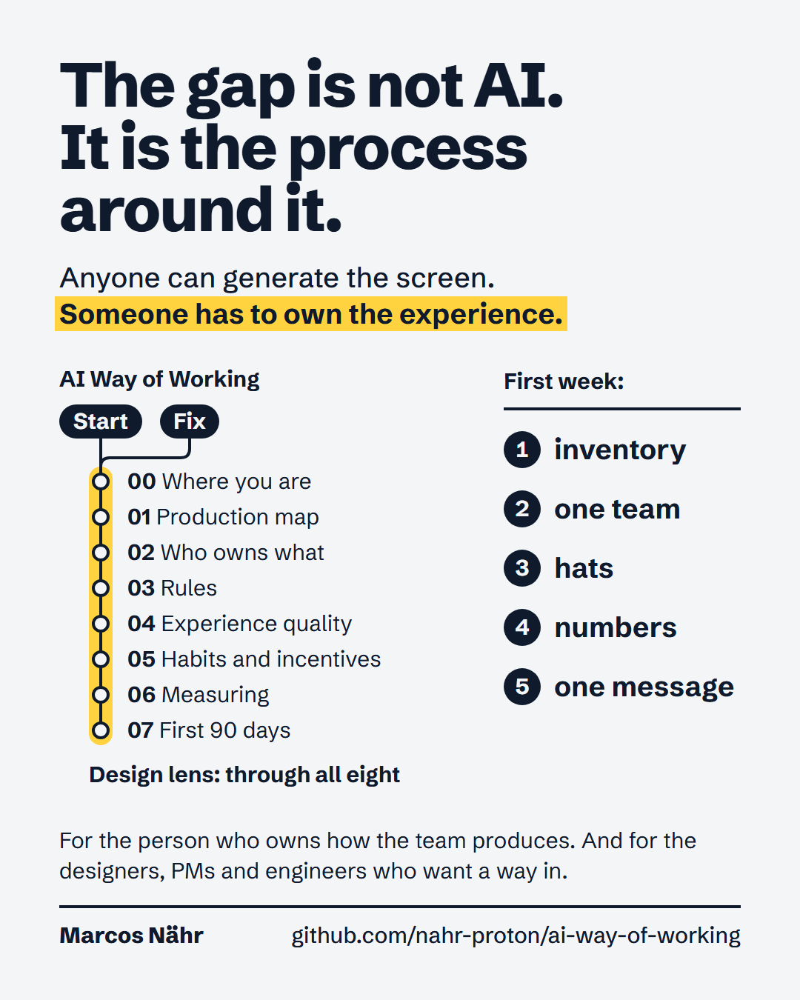
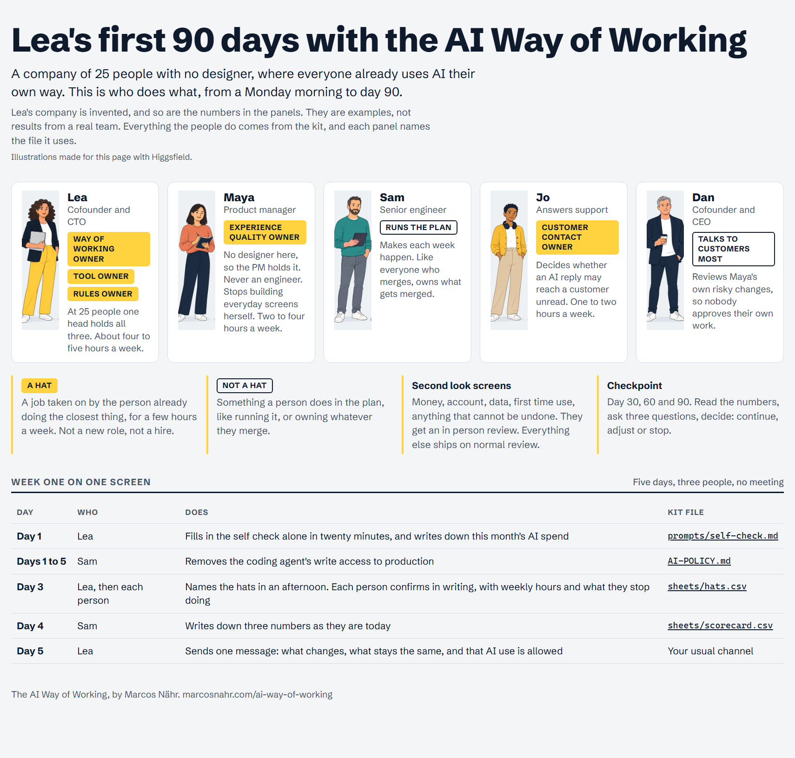

# The AI Way of Working: the kit

**What it is:** the files a team copies into its own repo, wiki and spreadsheet to run the AI Way of Working, starting today.
**Who fills it in:** the way of working owner, whoever runs how the team produces (founder, CTO, Head of Product, COO). They hand each file to the person named on it.
**When:** start with the self check on day 1. Every file says on its first lines who fills it in and when.

## What this is

The gap is not AI. It is the process around it: who decides, with what data, and who guards what the customer sees when anyone can generate a screen. This kit is that process, written as files to fill in: a policy, a hats sheet, a production map, a patterns file your AI tools read, a release checklist for pull requests, six prompts and five sheets.

The method is called the AI Way of Working. It is for companies of 20 to 250 people whose product or service has a user interface. What follows is my judgment, backed by named company cases where they exist. The eight parts hold the cases, the sources and the reasoning. The Notion template carries them today as pages to fill in; the full text comes to marcosnahr.com in a second wave.

## Where this sits

There are good files at the tool level: an instruction file for coding agents, vendor rule files, a review checklist for AI generated code. This kit uses them rather than replacing them. There are good reports at the executive level, and one with real data: DORA's seven AI capabilities. This kit maps to them in part 06. What I did not find anywhere is a method for the person who owns how a small product team produces, that treats what the customer sees as part of the process and gives that person a first week and a first 90 days with named owners. That is what this is. It has not been run end to end by a company yet. It is a proposal, and it is built to produce its own evidence at three checkpoints.

## The eight parts, and what each kit file comes from

| Part | The question it answers | Kit files that come from it |
|---|---|---|
| 00 Where you are | Is there a process? Where is AI already, and who owns it? | `prompts/self-check.md`, `sheets/inventory.csv` |
| 01 Production map | What are our steps, what does AI do at each, where must a human decide? | `WAY-OF-WORKING.md` (production map, Start minimum), `prompts/map-our-steps.md` |
| 02 Who owns what | Which hats exist at our size, who decides, where does design sit? | `WAY-OF-WORKING.md` (hats, decision rights), `sheets/hats.csv` |
| 03 Rules | What is allowed, with what data, and who says yes first? | `AI-POLICY.md`, `sheets/inventory.csv` |
| 04 Experience quality | Who guards the user when anyone can generate output? | `patterns.md`, `instruction-file-snippet.md`, `PULL_REQUEST_TEMPLATE.md`, `prompts/review-preview-first.md`, `prompts/rate-a-defect.md`, `prompts/our-high-severity-list.md` |
| 05 Habits and incentives | How does behavior change, and what do we reward? | `prompts/incentive-check.md` |
| 06 Measuring | Did it work? | `sheets/scorecard.csv`, `sheets/edit-rate-tally.csv` |
| 07 First 90 days | What happens week by week on each path? | `sheets/90-day-plan.csv` |

## Two paths

The self check sets your path from one count: how many of the seven production steps (discovery, design, build, review, release, operate, support) have a named person and a signal that says done. The path is a reading order, not a verdict.

| Path | You are here if | Parts in order |
|---|---|---|
| Start | Fewer than five steps named. Little process, everyone uses AI their own way, nothing to fix yet | 00, 02, 01, 04, 03, 07 |
| Fix | Five or more steps named. The process exists; AI arrived through tools nobody chose together | 00, 02, 03, 01, 04, 07 |

On both paths, read parts 05 and 06 when the 90 day plan calls for them.

## The first week

Inventory, one team, hats, numbers, one message.

| Day | Do this | With |
|---|---|---|
| 1 | Fill in the self check. Twenty minutes, plus the inventory. Write down AI spend from the bill before any tool is cut. Close any of flags 1 to 4 this week | `prompts/self-check.md`, `sheets/inventory.csv` |
| 2 | Pick one team: the longest review queue, or the UI most customers touch. At 25 people, the one team is everyone who ships | `WAY-OF-WORKING.md`, section 3, first use case |
| 3 | Name the hats on the people already doing the closest thing, with weekly hours | `WAY-OF-WORKING.md`, sections 1 and 2, `sheets/hats.csv` |
| 4 | Write down today's lead time, review wait and rework | `sheets/scorecard.csv` |
| 5 | One message to everyone: what changes first, what stays the same, and that AI use is allowed and judged by whether the work works | Your usual channel |

## Who does what, in pictures

A cartoon of the Start path at a company of 25 people with no designer: who does what, from day 1 to day 90, and which kit file each step uses. The company and its numbers are invented.

The rest of the story: [days 1 to 30](comic/2-days-1-to-30.png) and [days 31 to 90](comic/3-days-31-to-90.png). The whole comic as one page: https://marcosnahr.com/ai-way-of-working/first-90-days

## How to start today

1. Paste `prompts/self-check.md` into an assistant on a company account and answer its questions. You get your two pages and your path.
2. Copy `patterns.md` to the root of your main repo, `PULL_REQUEST_TEMPLATE.md` to where your code host looks for one, and the paragraph in `instruction-file-snippet.md` into your coding assistants' instruction file. The experience quality owner fills in `patterns.md` this week.
3. Copy the five files in `sheets/` into one spreadsheet, one tab each. Delete the rows marked EXAMPLE.
4. Put `AI-POLICY.md` and `WAY-OF-WORKING.md` where the team already looks. Hand the policy to the rules owner once the hats are named.

Every blank looks `{{like this}}`. Replace it with a name, a date or a link. A blank you cannot fill is a finding: write "nobody" or "unknown" and ask one person this week.

Nothing here needs a new meeting or a new role. If a file does, cut it down.

## If you want to try it

If you want to run the first 90 days and see what the checkpoints say, I will help. The kit is yours. I sit in on the three checkpoints, and what we learn gets published, anonymized, with your consent. Three teams of 20 to 250 people, this year. Message me on LinkedIn: https://www.linkedin.com/in/marcos-nahr/

## More

- The method on the web: https://marcosnahr.com/ai-way-of-working
- The eight parts as pages to fill in, and the same kit as a Notion template you can duplicate, with the sheets as databases: https://pickle-thief-449.notion.site/AI-Way-of-Working-3e5f11bd02a981908f38d91896323c7f
- The full parts with cases and reasons, and how this compares with other models: coming to marcosnahr.com.

I name tools only as dated examples. The names change faster than the method.

License: CC BY 4.0. Copy it, adapt it, keep my name on it. The full text is in `LICENSE`. That includes the comic in `comic/`, whose illustrations were made for it with Higgsfield.

Marcos Nähr
